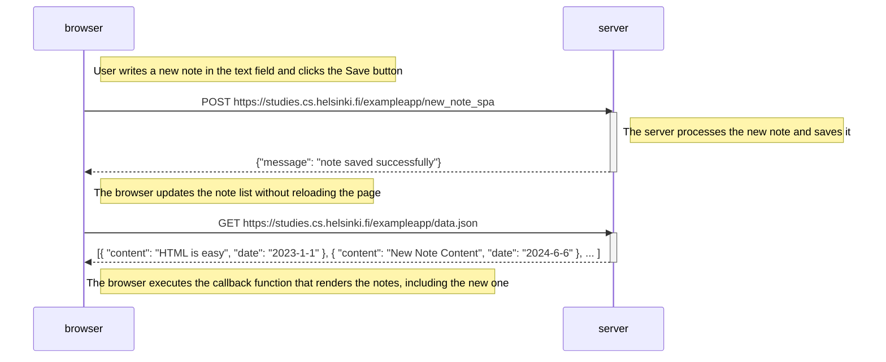

```mermaid
sequenceDiagram
    participant browser
    participant server

    Note right of browser: User writes a new note in the text field and clicks the Save button

    browser->>server: POST https://studies.cs.helsinki.fi/exampleapp/new_note_spa
    activate server
    Note right of server: The server processes the new note and saves it
    server-->>browser: {"message": "note saved successfully"}
    deactivate server

    Note right of browser: The browser updates the note list without reloading the page

    browser->>server: GET https://studies.cs.helsinki.fi/exampleapp/data.json
    activate server
    server-->>browser: [{ "content": "HTML is easy", "date": "2023-1-1" }, { "content": "New Note Content", "date": "2024-6-6" }, ... ]
    deactivate server

    Note right of browser: The browser executes the callback function that renders the notes, including the new one

```